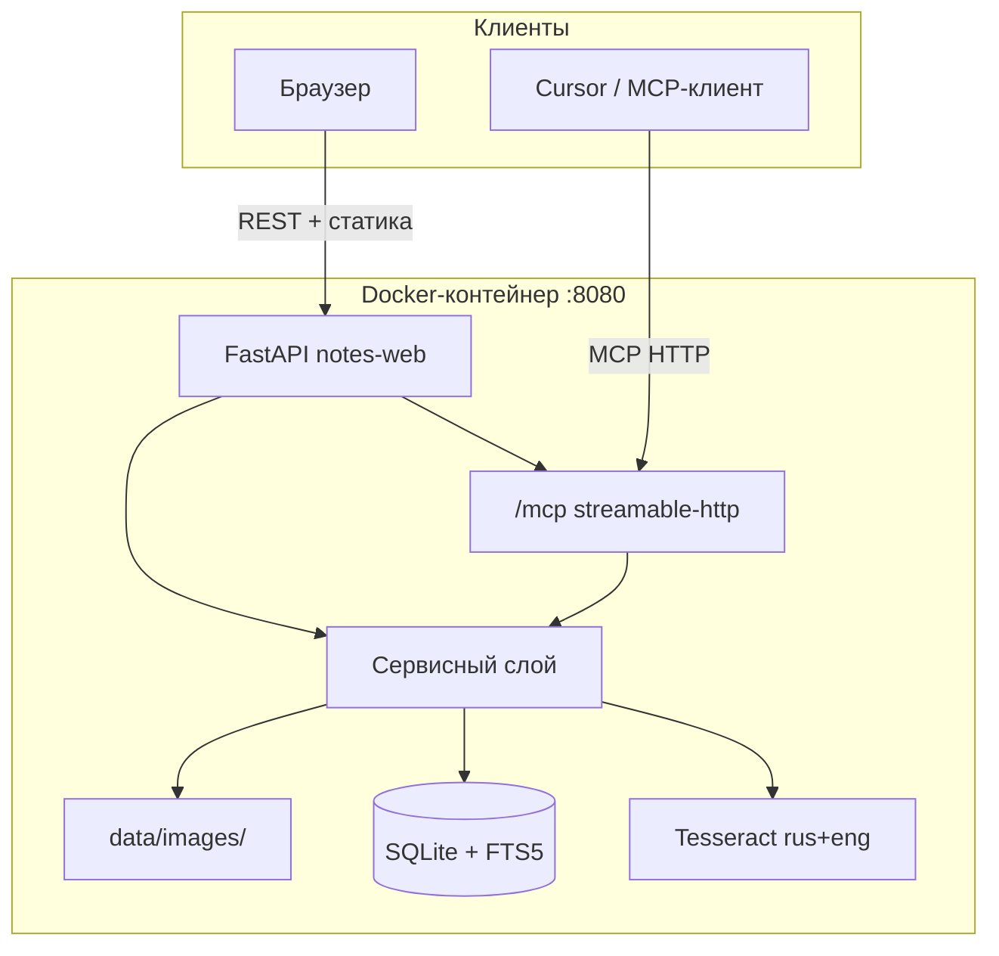
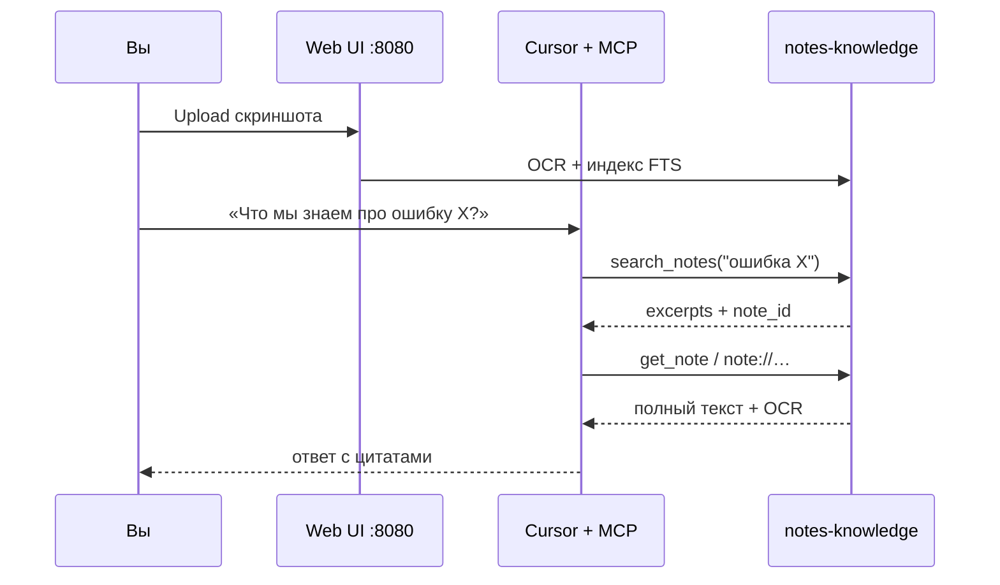

# Notes Knowledge MCP

Локальная база знаний для скриншотов и заметок с **OCR**, **полнотекстовым поиском**, **веб-интерфейсом** и сервером **[Model Context Protocol (MCP)](https://modelcontextprotocol.io/)** для AI-ассистентов (например, Cursor).

Загрузите изображение → Tesseract извлекает текст (русский + английский) → ищите по тексту заметок и OCR → подключите редактор через MCP.

**Tesseract работает только внутри Docker.** На хосте ставить пакеты OCR не нужно.

## Содержание

- [Возможности](#возможности)
- [Архитектура](#архитектура)
- [Требования](#требования)
- [Быстрый старт](#быстрый-старт)
- [Подключение Cursor (MCP)](#подключение-cursor-mcp)
- [Переменные окружения](#переменные-окружения)
- [Языки OCR](#языки-ocr)
- [REST API](#rest-api)
  - [Формат ответа поиска](#формат-ответа-поиска)
  - [Пример загрузки](#пример-загрузки)
- [Инструменты MCP](#инструменты-mcp)
  - [Ресурсы MCP](#ресурсы-mcp)
  - [Промпт MCP](#промпт-mcp)
- [Примеры использования MCP](#примеры-использования-mcp)
  - [Запросы в чате Cursor](#запросы-в-чате-cursor-естественный-язык)
  - [Сценарий 1: текстовая заметка и поиск](#сценарий-1-текстовая-заметка-и-поиск)
  - [Сценарий 2: скриншот с OCR](#сценарий-2-скриншот-с-ocr)
  - [Сценарий 3: несколько изображений в одной заметке](#сценарий-3-несколько-изображений-в-одной-заметке)
  - [Сценарий 4: ресурсы MCP](#сценарий-4-ресурсы-mcp)
  - [Сценарий 5: промпт summarize_search_results](#сценарий-5-промпт-summarize_search_results)
  - [Сценарий 6: правка и удаление](#сценарий-6-правка-и-удаление)
  - [Сценарий 7: типичный рабочий цикл](#сценарий-7-типичный-рабочий-цикл)
  - [Ошибки MCP](#ошибки-mcp-что-вернёт-сервер)
  - [Проверка MCP без Cursor](#проверка-mcp-без-cursor)
- [Правила для изображений](#правила-для-изображений)
- [Структура проекта](#структура-проекта)
- [Локальная разработка (только код)](#локальная-разработка-только-код)
- [Хранение данных](#хранение-данных)
- [Решение проблем](#решение-проблем)
- [Лицензия](#лицензия)

---

## Возможности

| Область | Описание |
|---------|----------|
| **Веб-UI** | Загрузка скриншотов, поиск с подсветкой совпадений в абзацах, просмотр изображений в модальном окне |
| **OCR** | Tesseract `rus+eng` для печатного текста и скриншотов интерфейса (не для рукописи) |
| **Поиск** | SQLite FTS5 по заголовкам, телу заметок и OCR; несколько фрагментов на одну заметку |
| **MCP** | Инструменты для создания/поиска/загрузки; ресурсы `note://{id}`, `notes://recent` |
| **Хранение** | SQLite + файлы изображений в Docker-томе |

---

## Архитектура



Один процесс (`notes-web`) отдаёт UI, REST API и MCP на порту **8080**.

---

## Требования

- [Docker](https://docs.docker.com/get-docker/) и Docker Compose v2
- По желанию: Python 3.11+ и venv **только** для правки кода (OCR по-прежнему через Docker)

---

## Быстрый старт

```bash
git clone <url-репозитория> otus-mcp
cd otus-mcp

make up      # собрать образ и запустить в фоне
make down    # остановить
make logs    # смотреть логи
make restart # пересобрать и перезапустить
```

Откройте UI: **http://localhost:8080**

| Вкладка | Назначение |
|---------|------------|
| **Поиск** | Поиск по тексту заметок и OCR; абзацы с подсветкой; просмотр скриншота; кнопка **Удалить** |
| **Загрузка** | Заголовок, описание, файл → OCR → заметка в индексе |
| **Настройки** | API модели, публичный URL MCP, копирование JSON для Cursor |


Данные хранятся в Docker-томе `notes-data` (`notes.db` и `data/images/`).

---

## Подключение Cursor (MCP)

1. Запустите стек: `make up`
2. В UI откройте **Настройки** и скопируйте **Конфиг Cursor MCP**, либо вставьте:

```json
{
  "mcpServers": {
    "notes-knowledge": {
      "url": "http://localhost:8080/mcp",
      "transport": "streamable-http"
    }
  }
}
```

3. Вставьте в `.cursor/mcp.json` (проект или глобально). В репозитории уже есть [`.cursor/mcp.json`](.cursor/mcp.json).
4. Перезапустите Cursor.

Контейнер должен быть запущен, когда вы вызываете MCP-инструменты из редактора.

---

## Переменные окружения

| Переменная | По умолчанию | Описание |
|------------|--------------|----------|
| `NOTES_MCP_DATA_DIR` | `/app/data` (в Docker) | Каталог БД и изображений |
| `NOTES_MCP_HOST` | `0.0.0.0` | Адрес привязки сервера |
| `NOTES_MCP_PORT` | `8080` | Порт HTTP (UI + API + MCP) |
| `NOTES_MCP_PUBLIC_URL` | `http://localhost:8080` | Базовый URL в настройках и MCP |
| `NOTES_MCP_OCR_LANG` | `rus+eng` | Языки Tesseract по умолчанию |

Переопределение — в [`docker-compose.yml`](docker-compose.yml).

---

## Языки OCR

Устанавливаются в [Dockerfile](Dockerfile):

- `tesseract-ocr`
- `tesseract-ocr-rus`
- `tesseract-ocr-eng`

Строка по умолчанию: **`rus+eng`** (можно менять при загрузке и в **Настройках**).

| Значение | Когда использовать |
|----------|-------------------|
| `rus+eng` | Смешанный русский интерфейс и английские подписи |
| `rus` | Только русский |
| `eng` | Только английский |

---

## REST API

Базовый URL: `http://localhost:8080`

| Метод | Путь | Описание |
|-------|------|----------|
| `GET` | `/api/health` | Проверка работоспособности |
| `GET` | `/api/notes` | Список заметок (`limit`, `offset`) |
| `GET` | `/api/notes/{id}` | Заметка с изображениями и OCR |
| `POST` | `/api/notes` | Создать заметку (JSON: `title`, `body`) |
| `DELETE` | `/api/notes/{id}` | Удалить заметку и файлы |
| `GET` | `/api/search?q=…` | Поиск с фрагментами-абзацами |
| `POST` | `/api/upload` | Multipart: `title`, `body`, `file`, `ocr_lang` |
| `POST` | `/api/notes/{id}/images` | Добавить изображение к заметке |
| `GET` | `/api/images/{id}` | Отдать сохранённый скриншот |
| `GET` | `/api/settings` | Прочитать настройки + JSON для Cursor |
| `PUT` | `/api/settings` | Обновить настройки |

### Формат ответа поиска

У каждого совпадения есть `excerpts` — абзацы, где найден запрос, с сегментами для подсветки:

```json
{
  "query": "таймаут",
  "count": 1,
  "hits": [
    {
      "note_id": "…",
      "title": "Ошибка API",
      "score": 0.0,
      "excerpts": [
        {
          "source": "ocr",
          "label": "Screenshot (OCR)",
          "image_id": "…",
          "paragraph": "Таймаут подключения к db:5432",
          "segments": [
            { "text": "Таймаут ", "match": false },
            { "text": "подключения", "match": true },
            { "text": " к db:5432", "match": false }
          ]
        }
      ]
    }
  ]
}
```

### Пример загрузки

```bash
curl -X POST http://localhost:8080/api/upload \
  -F "title=Ошибка на staging" \
  -F "body=Скрин с дашборда" \
  -F "ocr_lang=rus+eng" \
  -F "file=@screenshot.png"
```

---

## Инструменты MCP

| Инструмент | Описание |
|------------|----------|
| `create_note` | Создать заметку; опционально `image_paths` (абсолютные пути внутри контейнера) |
| `update_note` | Изменить `title` / `body` |
| `add_image` | Прикрепить изображение и выполнить OCR |
| `reprocess_image` | Повторить OCR для сохранённого изображения |
| `search_notes` | Полнотекстовый поиск (JSON с excerpts) |
| `get_note` | Заметка по id |
| `list_notes` | Список последних заметок |
| `delete_note` | Удалить заметку и файлы |

### Ресурсы MCP

- `note://{note_id}` — Markdown с блоками OCR
- `notes://recent` — список недавних заметок

### Промпт MCP

- `summarize_search_results` — поиск и краткое резюме результатов

---

## Примеры использования MCP

Перед вызовом инструментов запустите сервер:

```bash
make up
```

Убедитесь, что в Cursor подключён MCP `notes-knowledge` (см. раздел **Подключение Cursor (MCP)** выше).

### Запросы в чате Cursor (естественный язык)

Агент сам выберет нужные инструменты. Примеры формулировок:

| Задача | Пример запроса |
|--------|----------------|
| Поиск по базе | «Найди в notes-knowledge все заметки про таймаут подключения к базе» |
| Создать заметку | «Создай заметку с заголовком "Релиз 1.2" и текстом "Чеклист перед выкладкой"» |
| Список | «Покажи последние 10 заметок из knowledge base» |
| Прочитать | «Открой заметку `{note_id}` и покажи OCR с картинок» |
| Резюме поиска | «Используй промпт summarize_search_results для запроса "ошибка 500"» |
| Ресурс | «Прочитай ресурс `notes://recent`» |


Скриншоты удобнее загружать через **веб-UI** (вкладка **Загрузка**): файл попадает в контейнер и сразу проходит OCR.  
Инструмент `add_image` принимает **абсолютный путь к файлу на стороне сервера** (внутри контейнера), а не путь на вашем ноутбуке.

### Сценарий 1: текстовая заметка и поиск

**1. Создать заметку** — инструмент `create_note`:

```json
{
  "title": "Инцидент 2025-05-20",
  "body": "На staging падал сервис auth из-за таймаута к PostgreSQL на порту 5432."
}
```

**2. Найти по ключевым словам** — `search_notes`:

```json
{
  "query": "таймаут PostgreSQL",
  "limit": 10
}
```

Фрагмент ответа (поле `excerpts` — абзацы с подсветкой):

```json
{
  "query": "таймаут PostgreSQL",
  "count": 1,
  "hits": [
    {
      "note_id": "a1b2c3d4-…",
      "title": "Инцидент 2025-05-20",
      "score": 0.0,
      "excerpts": [
        {
          "source": "body",
          "label": "Note text",
          "paragraph": "На staging падал сервис auth из-за таймаута к PostgreSQL на порту 5432.",
          "segments": [
            { "text": "…из-за ", "match": false },
            { "text": "таймаута", "match": true },
            { "text": " к ", "match": false },
            { "text": "PostgreSQL", "match": true }
          ]
        }
      ]
    }
  ]
}
```

**3. Получить заметку целиком** — `get_note`:

```json
{
  "note_id": "a1b2c3d4-…",
  "include_images": true
}
```

### Сценарий 2: скриншот с OCR

**Вариант A (рекомендуется):** загрузить PNG/JPG на http://localhost:8080 → вкладка **Загрузка** → затем в Cursor:

> «Найди в knowledge base текст "Connection refused"»

**Вариант B:** файл уже внутри контейнера (например, скопирован через `docker cp`):

```bash
docker cp ./screen.png notes-knowledge:/tmp/screen.png
```

Вызов MCP `add_image`:

```json
{
  "note_id": "a1b2c3d4-…",
  "image_path": "/tmp/screen.png",
  "ocr_lang": "rus+eng"
}
```

Пример успешного ответа:

```json
{
  "message": "Text extracted from image.",
  "image": {
    "id": "img-uuid-…",
    "note_id": "a1b2c3d4-…",
    "ocr_text": "Error: connection refused 127.0.0.1:5432",
    "ocr_lang": "rus+eng",
    "ocr_char_count": 42
  }
}
```

Повторный OCR с другим языком — `reprocess_image`:

```json
{
  "image_id": "img-uuid-…",
  "ocr_lang": "rus"
}
```

### Сценарий 3: несколько изображений в одной заметке

```json
// create_note — сначала без картинок
{ "title": "Спринт-демо", "body": "Скрины с доски" }

// add_image — для каждого файла в контейнере
{ "note_id": "…", "image_path": "/tmp/board-1.png", "ocr_lang": "rus+eng" }
{ "note_id": "…", "image_path": "/tmp/board-2.png", "ocr_lang": "rus+eng" }
```

Поиск `search_notes` с `query: "спринт"` найдёт совпадения и в `body`, и во всех OCR-текстах.

### Сценарий 4: ресурсы MCP

| URI | Назначение |
|-----|------------|
| `notes://recent` | Краткий список последних заметок (id, заголовок, дата) |
| `note://a1b2c3d4-…` | Полный Markdown: заголовок, body, блоки OCR по каждому скриншоту |

В Cursor:

> «Прочитай ресурс note://`{id}` и кратко перескажи, что на скриншотах»

### Сценарий 5: промпт `summarize_search_results`

Параметр:

```json
{ "query": "kubernetes pod crash" }
```

Промпт возвращает инструкцию агенту: выполнить поиск и сжато описать найденное. Удобно для обзора инцидентов:

> «Запусти summarize_search_results для "падение pod" и сделай summary на русском»

### Сценарий 6: правка и удаление

**Обновить текст:**

```json
{
  "note_id": "a1b2c3d4-…",
  "title": "Инцидент 2025-05-20 (закрыт)",
  "body": "Причина: истёк pool соединений. Fix: увеличен max_connections."
}
```

**Удалить:**

```json
{ "note_id": "a1b2c3d4-…" }
```

### Сценарий 7: типичный рабочий цикл



1. `make up`
2. Загрузить скрин через UI
3. В Cursor искать и уточнять через `search_notes` / `get_note`
4. При необходимости дописать контекст через `update_note`

### Ошибки MCP (что вернёт сервер)

| Ситуация | Поле в ответе |
|----------|----------------|
| Заметка не найдена | `{"error": "Note not found: …"}` |
| Файл не на сервере / неверный путь | `{"error": "Image file not found: …"}` |
| Tesseract недоступен (контейнер не запущен) | `{"error": "Tesseract is not available… make up"}` |
| Пустой поисковый запрос | `{"error": "Search query cannot be empty"}` |

### Проверка MCP без Cursor

С [MCP Inspector](https://github.com/modelcontextprotocol/inspector):

```bash
npx -y @modelcontextprotocol/inspector
```

Подключение: **Streamable HTTP** → `http://localhost:8080/mcp` → вызов `list_notes` или `search_notes`.

---

## Правила для изображений

- **Форматы:** `.png`, `.jpg`, `.jpeg`, `.webp`, `.gif`, `.bmp`, `.tiff`, `.tif`
- **Размер:** до 10 МБ на файл
- **Содержимое:** печатный текст и скриншоты UI (рукопись не поддерживается)

---

## Структура проекта

```
otus-mcp/
├── Dockerfile              # Python 3.12 + Tesseract rus/eng
├── docker-compose.yml
├── Makefile                # up, down, logs, restart
├── pyproject.toml
├── images/                 # Скриншоты для README (не путать с data/images/)
│   ├── app-01-search.png   # Веб-UI: вкладка «Поиск»
│   ├── app-02-settings.png # Веб-UI: вкладка «Настройки»
│   ├── mcp-all.png         # Cursor: список заметок с OCR
│   └── mcp-search.png      # Cursor: поиск по OCR-тексту
├── src/notes_mcp/
│   ├── server.py           # MCP (stdio + HTTP для mount)
│   ├── web/
│   │   ├── app.py          # FastAPI: UI, REST, mount /mcp
│   │   └── static/         # Фронтенд
│   ├── db.py               # SQLite + FTS5
│   ├── ocr.py              # Обёртка Tesseract
│   ├── storage.py          # Хранилище изображений
│   ├── service.py          # Бизнес-логика
│   ├── search_excerpts.py  # Абзацы и подсветка в поиске
│   └── settings_store.py   # Настройки UI/MCP (JSON)
├── scripts/
│   ├── smoke_test.py
│   └── test_search_excerpts.py
└── .cursor/mcp.json
```

---

## Локальная разработка (только код)

Без установки Tesseract на хост:

```bash
python3 -m venv .venv
source .venv/bin/activate
pip install -e .

python scripts/test_search_excerpts.py
python scripts/smoke_test.py
```

**Загрузка и OCR — только через Docker:**

```bash
make up
# UI и API: http://localhost:8080
```

Запуск веб-сервера вне Docker (OCR не заработает без ручной установки Tesseract — не рекомендуется):

```bash
notes-web
```

Только MCP по stdio (без UI):

```bash
notes-mcp
```

---

## Хранение данных

| Путь (в контейнере) | Содержимое |
|---------------------|------------|
| `/app/data/notes.db` | Заметки, метаданные изображений, FTS-индекс |
| `/app/data/images/` | Копии скриншотов |
| `/app/data/settings.json` | Настройки UI (модель, URL MCP, OCR по умолчанию) |

Полный сброс данных:

```bash
make down
docker volume rm otus-mcp_notes-data
make up
```

---

## Решение проблем

| Симптом | Что проверить |
|---------|----------------|
| UI недоступен | `docker compose ps` — статус `healthy` |
| OCR пустой / ошибка | Запущен Docker (`make up`); на хосте Tesseract не ставится намеренно |
| MCP в Cursor не работает | Контейнер запущен; URL `http://localhost:8080/mcp`; перезапуск Cursor |
| Поиск ничего не находит | Упростите запрос; качество OCR зависит от чёткости скриншота |
| Плохой кириллический OCR | Укажите `rus` или `rus+eng`; текст на изображении должен быть читаемым |

Логи:

```bash
make logs
```

---

## Лицензия

MIT — учебный / курсовой проект.
