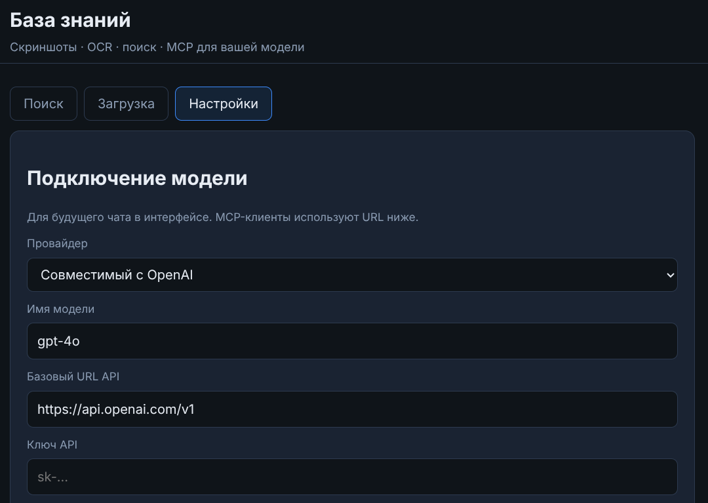
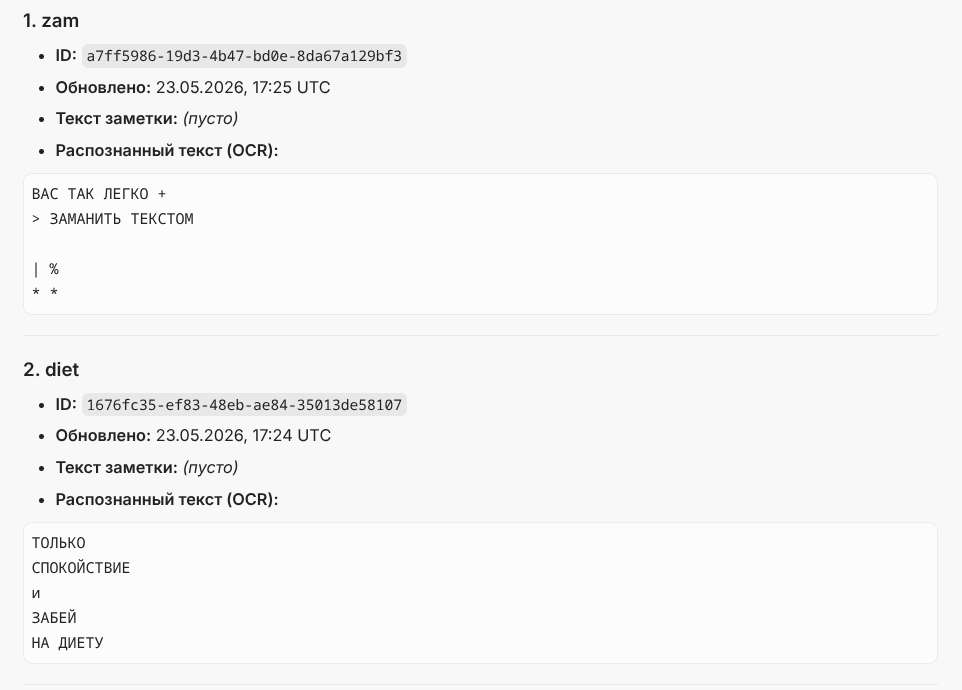
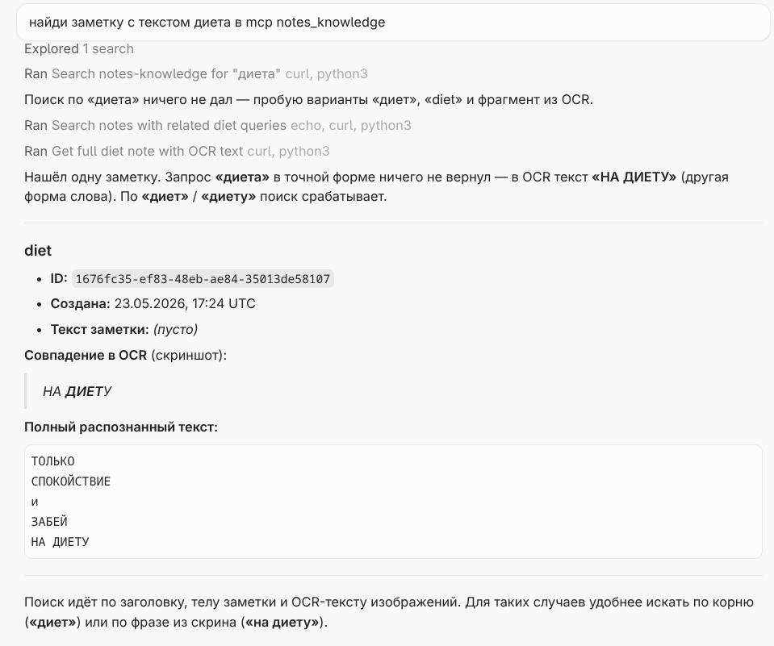
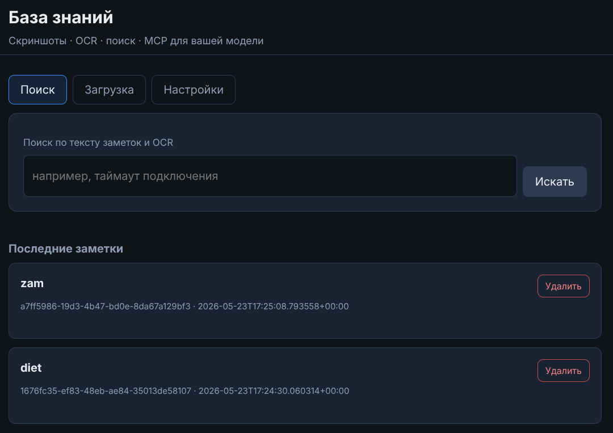

# Отчёт: MCP‑сервер «Notes Knowledge»

**Проект:** `otus-mcp` — локальная база знаний со скриншотами, OCR и полнотекстовым поиском.  
**IDE:** Cursor  
**Транспорт MCP:** Streamable HTTP (`http://localhost:8080/mcp`)  
**Стек:** Python 3.12, FastAPI, FastMCP, SQLite FTS5, Tesseract (Docker)

---

## 1. Проект и окружение

### 1.1. Структура

Проект размещён в корне репозитория `otus-mcp`:

```
otus-mcp/
├── pyproject.toml          # зависимости и entry points
├── docker-compose.yml      # запуск сервера + Tesseract
├── Dockerfile
├── Makefile                # up / down / logs / restart
├── .cursor/mcp.json        # конфиг MCP для Cursor
├── .env.example            # шаблон переменных окружения
├── src/notes_mcp/          # исходный код
│   ├── server.py           # MCP-инструменты
│   ├── web/app.py          # FastAPI: UI + REST + mount /mcp
│   ├── db.py               # SQLite + FTS5
│   └── ...
├── images/                 # скриншоты для отчёта
└── report.md               # этот файл
```

### 1.2. Зависимости

Зафиксированы в [`pyproject.toml`](pyproject.toml):

| Пакет | Назначение |
|-------|------------|
| `mcp` | SDK MCP (FastMCP) |
| `fastapi`, `uvicorn` | HTTP-сервер, UI, REST |
| `pillow`, `pytesseract` | OCR скриншотов |
| `python-multipart` | загрузка файлов |

Установка для разработки:

```bash
python3 -m venv .venv
source .venv/bin/activate
pip install -e .
```

**OCR и полный стек — только через Docker** (Tesseract `rus+eng` в образе).

### 1.3. Запуск

```bash
make up          # собрать и поднять контейнер notes-knowledge
make logs        # логи (в т.ч. вызовы MCP-инструментов)
make down        # остановить
```

UI и MCP: **http://localhost:8080**  
MCP endpoint: **http://localhost:8080/mcp**

### 1.4. Секреты и конфигурация

- Секреты **не коммитятся**. В `.gitignore` добавлены `.env`, `data/`.
- Шаблон переменных: [`.env.example`](.env.example).
- Ключ OpenAI (опционально, для будущего чата в UI) задаётся через веб-интерфейс → **Настройки** или переменную `OPENAI_API_KEY` в `.env` — в репозиторий не попадает.

| Переменная | По умолчанию | Описание |
|------------|--------------|----------|
| `NOTES_MCP_DATA_DIR` | `/app/data` | БД и файлы |
| `NOTES_MCP_PORT` | `8080` | Порт HTTP |
| `NOTES_MCP_PUBLIC_URL` | `http://localhost:8080` | URL для MCP-клиентов |
| `NOTES_MCP_OCR_LANG` | `rus+eng` | Языки OCR по умолчанию |

---

## 2. Принципы MCP

**Как IDE/агент подключается к MCP‑серверу**

Cursor читает конфиг `.cursor/mcp.json` и устанавливает соединение с MCP‑сервером по протоколу **Streamable HTTP** на `http://localhost:8080/mcp`. При запросе пользователя в чате агент видит список доступных **tools** (инструментов), **resources** (ресурсов) и **prompts** (промптов), которые объявил сервер. Агент сам выбирает нужный инструмент, передаёт аргументы по JSON‑схеме и получает структурированный ответ. Сервер должен быть запущен (`make up`) на время работы с MCP.

**Что считается «tool» в этом сервере**

**Tool** — именованная операция с описанием и типизированными параметрами, которую агент может вызвать программно. В нашем сервере tool — это Python‑функция, зарегистрированная через `@logged_tool` / FastMCP, например `search_notes(query, limit, offset)`. Каждый tool возвращает **JSON‑строку** с полями `count`, `hits`, `notes`, `error` и т.д. — не произвольный текст. Дополнительно объявлены **resources** (`note://{id}`, `notes://recent`) для чтения контекста и **prompt** `summarize_search_results` для сценария «найди и резюмируй».

---

## 3. Реализация MCP‑сервера

### 3.1. Транспорт и эндпоинт

| Режим | Команда | Транспорт | URL / способ |
|-------|---------|-----------|--------------|
| Production (Docker) | `notes-web` | Streamable HTTP | `http://localhost:8080/mcp` |
| Локальная отладка | `notes-mcp` | stdio | запуск процесса Cursor'ом |

В Docker один процесс FastAPI монтирует MCP на `/mcp` (`src/notes_mcp/web/app.py`).

### 3.2. Инструменты (8 шт.)

| Tool | Описание | Ключевые параметры | Формат ответа |
|------|----------|-------------------|---------------|
| `create_note` | Создать заметку, опционально с изображениями | `title`, `body`, `image_paths`, `ocr_lang` | `{id, title, body, images?, ...}` |
| `search_notes` | Полнотекстовый поиск (заголовок, body, OCR) | `query`, `limit`, `offset` | `{query, count, hits[{note_id, excerpts}]}` |
| `list_notes` | Список последних заметок | `limit`, `offset` | `{count, notes[]}` |
| `get_note` | Заметка по ID с OCR | `note_id`, `include_images` | `{id, title, body, images[]}` |
| `add_image` | Прикрепить изображение + OCR | `note_id`, `image_path`, `ocr_lang` | `{message, image{ocr_text, ...}}` |
| `update_note` | Обновить заголовок/текст | `note_id`, `title`, `body` | объект заметки |
| `reprocess_image` | Повторный OCR | `image_id`, `ocr_lang` | `{message, image}` |
| `delete_note` | Удалить заметку и файлы | `note_id` | `{deleted}` |

Пример схемы (генерируется FastMCP из аннотаций Python):

```python
@logged_tool
def search_notes(query: str, limit: int = 20, offset: int = 0) -> str:
    """Full-text search across note titles, bodies, and OCR text from images."""
    ...
    return _json({"query": query, "count": len(hits), "hits": hits})
```

При ошибке возвращается JSON: `{"error": "..."}`, а не исключение наружу протокола.

### 3.3. Практичный сценарий (Context7‑подход)

Выбран вариант **Doc/Code context tool** + **Project helper**:

- Пользователь загружает скриншоты (UI или MCP `add_image`) → Tesseract извлекает текст → SQLite FTS5 индексирует.
- Агент через `search_notes` / `get_note` получает **контекст из локальной базы** (цитаты, OCR‑фрагменты с подсветкой) — аналог «справки по проекту», но источник — ваши заметки и скрины, а не внешняя документация.
- Ресурс `notes://recent` даёт быстрый обзор без вызова tool.

---

## 4. Безопасность

| Область | Ограничение |
|---------|-------------|
| **Файлы изображений** | `add_image` / `create_note` принимают только **абсолютные пути внутри контейнера**; валидация формата и размера (≤ 10 МБ) в `storage.py` |
| **Данные** | Хранятся в Docker-томе `notes-data`, не в git |
| **Секреты** | API-ключи не логируются (редакция полей с `key`, `secret`, `token`, `password`) |
| **Команды shell** | MCP **не выполняет** произвольные команды — только операции с БД и OCR |
| **Сеть** | Сервер слушает `localhost:8080` (проброс порта в docker-compose) |

Подробнее: раздел «Правила для изображений» и «Хранение данных» в [README.md](README.md).

---

## 5. Интеграция с Cursor

### 5.1. Конфигурация

Файл [`.cursor/mcp.json`](.cursor/mcp.json):

```json
{
  "mcpServers": {
    "notes-knowledge": {
      "url": "http://localhost:8080/mcp",
      "transport": "streamable-http"
    }
  }
}
```

### 5.2. Как включить (5 шагов)

1. Клонировать репозиторий и перейти в каталог `otus-mcp`.
2. Запустить сервер: `make up`.
3. Убедиться, что UI открывается: http://localhost:8080 (бadge «в сети»).
4. Скопировать конфиг MCP в `.cursor/mcp.json` (в проекте уже есть) или в глобальные настройки Cursor.
5. **Перезапустить Cursor** — в списке MCP появится `notes-knowledge`.

Альтернатива: вкладка **Настройки** в UI → блок «Конфиг Cursor MCP» → копировать JSON.



---

## 6. Проверка: вызовы инструментов из IDE

Ниже — три реальных запроса в чате Cursor с ожидаемым tool и подтверждением.

### Запрос 1: список последних заметок

| | |
|---|---|
| **Запрос пользователя** | «Покажи последние заметки из notes-knowledge» |
| **Ожидаемый tool** | `list_notes` (или REST `GET /api/notes`) |
| **Подтверждение** | Агент вернул таблицу заметок `zam`, `diet` с ID и датами |



### Запрос 2: заметки с OCR-текстом

| | |
|---|---|
| **Запрос пользователя** | «Покажи не только заголовок, но и распознанный текст» |
| **Ожидаемый tool** | `list_notes` + `get_note` для каждой заметки |
| **Подтверждение** | В ответе OCR: «ВАС ТАК ЛЕГКО…», «ТОЛЬКО СПОКОЙСТВИЕ… НА ДИЕТУ» |

Тот же скриншот: [images/mcp-all.png](images/mcp-all.png).

### Запрос 3: поиск по OCR-тексту

| | |
|---|---|
| **Запрос пользователя** | «Найди заметку с текстом диета в mcp notes_knowledge» |
| **Ожидаемый tool** | `search_notes` с запросом `диет` / `диету` |
| **Подтверждение** | Найдена заметка `diet` (`1676fc35-…`), совпадение в OCR «НА ДИЕТУ» |



### Веб-UI (дополнительно)

Загрузка скриншотов и просмотр базы через браузер:



---

## 7. Логирование и отладка

### 7.1. Логи MCP на стороне сервера

В `src/notes_mcp/server.py` каждый tool обёрнут в `@logged_tool`. При вызове в stdout/лог пишется:

- **имя инструмента** (`name=search_notes`);
- **входные параметры** (секреты заменены на `***`, длинные строки обрезаются);
- **статус** `success` или `error` (в т.ч. JSON с полем `"error"`).

Пример (ожидаемый вывод при `make logs`):

```
2026-05-23 17:40:01 [INFO] notes_mcp.mcp: MCP tool call name=search_notes params={'query': 'диет', 'limit': 10, 'offset': 0}
2026-05-23 17:40:01 [INFO] notes_mcp.mcp: MCP tool result name=search_notes status=success
```

```
2026-05-23 17:39:55 [INFO] notes_mcp.mcp: MCP tool call name=list_notes params={'limit': 10, 'offset': 0}
2026-05-23 17:39:55 [INFO] notes_mcp.mcp: MCP tool result name=list_notes status=success
```

Просмотр:

```bash
make logs
# или
docker compose logs -f notes-knowledge
```

### 7.2. Другие способы отладки

| Способ | Команда / действие |
|--------|-------------------|
| Health API | `curl http://localhost:8080/api/health` |
| MCP Inspector | `npx -y @modelcontextprotocol/inspector` → Streamable HTTP → `http://localhost:8080/mcp` |
| Smoke-тест (без OCR) | `python scripts/smoke_test.py` |
| Docker health | `docker compose ps` → статус `healthy` |

---

## 8. Итог

| Требование | Статус |
|------------|--------|
| Проект + зависимости (`pyproject.toml`) | ✅ |
| `.env.example`, секреты не в git | ✅ |
| MCP Streamable HTTP + stdio | ✅ |
| ≥ 2–4 tools со схемой и JSON-ответом | ✅ (8 tools) |
| Context / helper сценарий | ✅ база знаний + OCR + FTS |
| Ограничения безопасности | ✅ описаны |
| Конфиг Cursor + инструкция | ✅ `.cursor/mcp.json`, README |
| ≥ 3 вызова из IDE | ✅ скриншоты в `images/` |
| Логирование tool call / params / status | ✅ `@logged_tool` |

Проект готов к проверке: `make up` → Cursor с MCP → запросы к базе знаний через чат.
